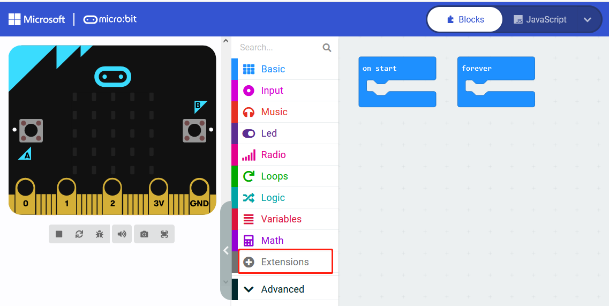
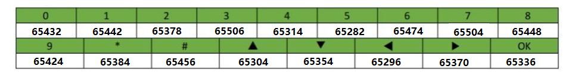

# Microbit_tutorial    
-------------------
**Makecode and Microbit basics:**    
If you don't have makecode and microbit basics, you can follow the link to learn the basics: [Click Me](https://docs.mosiwi.com/en/latest/microbit/M1D0000_microbit_mainboard/M1D0000_microbit_mainboard.html)    

## Wiring diagram        
-----------------
   

The USB port of the Microbit must be connected to the usb port of the PC through a micro usb cable.   

## Create a new project      
-----------------------          
Open the link to create a new online project: <https://makecode.microbit.org>     
  
  
## Load extension library      
-------------------------
  

Fill in the link to the right of the chain and search for: <https://github.com/Mosiwi/Mosiwi-basic-learning-kit-for-microbit>     
         
Wait for the loading of the library. After the loading is successful, the following figure is shown:   
       

## Block code parsing        
---------------------
▶ 1:      
The module returns a value that is the numeric input value for P11. When the keyboard on the expansion board is clicked, a low level is returned, indicating that the keyboard value on the expansion board can be read.        
     
Usage:      
Press any keyboard on the expansion board, the microbit dot matrix displays 0, otherwise displays 1.    
   
Because the P11 is also mapped to the microbit Buttom B, the keyboard value of the expansion board can also be read through the microbit Buttom B.     
       

▶ 2:       
Read the keyboard values on the expansion board.     
Usage:   
Press any key on the expansion board, and the microbit dot matrix displays the key value.       
      
Key value: U = 16, D = 8, L = 4, R = 2, OK = 1   

▶ 3:      
Clear the display on the 4-digit nixtube of the expansion board.   

▶ 4:    
4-digit nixie tube displays numeric values.   
Floating-point number display range: 0.0 to 999.9     
Integer range: 0 to 9999    
Usage:   
     

▶ 5:    
Let one of the 4-digit nixie tubes display the number.   
Parameter 1: 0 to 3, the position of the nixie tube to be lit.   
Parameter 2: 0 to 15 (0,1,2,3,4,5,6,7,8,9,A,B,C,D,E,F), characters to display.   

Usage:   
   

▶ 6:    
A display segment in a nixie tube.       
   

▶ 8:     
Let one of the 4-digit nixie tubes display a segment.   
Parameter 1: 0 to 3, the position of the nixie tube to be lit.   
Parameter 2:      

Usage:   
    
The 4th digit tube display 2 segments.    

▶ 9:    
Light an LED in the strip.  
Parameter 1: 0 to 8, the position of the LED to be lit.   
Parameter 2: (0: OFF, 1: ON)      

Usage:   
       

▶ 10:     
Controls the brightness of the RGB LED on the expansion board.    
Parameter 1: Red LED, green LED, blue LED.     
Parameter 2: 0 to 1023, brightness.   

▶ 11:      
Initial temperature and hygrometer.    

▶ 12:    
Read the temperature and humidity values and verify that the values are correct. Execute this block at a frequency greater than or equal to 2 seconds.        

▶ 13:       
Get the temperature or humidity value.   

Usage:   
     

▶ 14:    
When the ultrasonic module is connected to the Sensor interface of the expansion board, the measurement distance value of the ultrasonic module can be read. The unit is centimeter.           
     

Usage:     
   

▶ 15:      
The value of the infrared receiver, microphone or sliding resistor on the expansion board is read through the [I2C protocol](../../C1E0000_3in1_basic_learning_shield/C1E0000_3in1_basic_learning_shield.md#io-expand).        

Usage:   
Infrared receiver ([NEC](https://docs.mosiwi.com/en/latest/resource/nec_communication_protocol/nec_communication_protocol.html))   
    
     
     

Microphone    
    

Sliding resistor   
    

▶ 16:       
When the fan module is connected to the fan port on the expansion board, it is used to control the steering and speed of the fan module.    
     
Parameter 1: CW = clockwise rotation.     
Parameter 2: CCW = counterclockwise rotation.    

▶ 17:      
Read the key value on the expansion board, return 0 when the key is pressed, otherwise return 1. This key is connected to the P5 pin of the microbit.   
     

▶ 18:       
Reads a byte of data from the memory of the expansion board.    
Parameter: 0 to 16, Address of the memory.     

▶ 19:     
Write a byte of data to the memory of the expansion board.   
Parameter 1: 0 to 16, Address of the memory.      
Parameter 2: 0 to 255, Data to be stored in memory.  

Usage:     
     
4 digit nixie tube display 255.   

**End!**    
   
