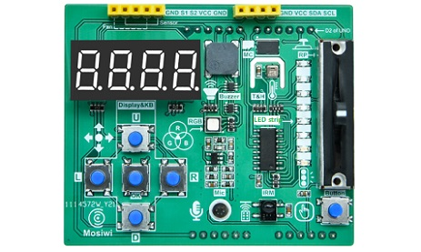
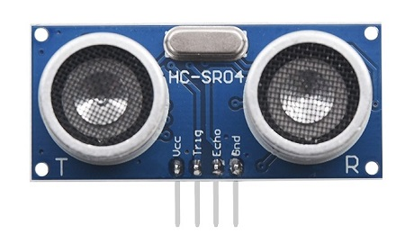

# Overview
----------
This kit is suitable for teaching and learning programming, providing tutorial materials for four development boards, including graphical, Python, and C/C++programming languages.     

## Detailed list  
----------------
| 1: [Raspberry pico](https://docs.mosiwi.com/en/latest/raspberry/R1D0001_raspberry_pico/R1D0001_raspberry_pico.html) | 2: [3in1_basic learing shield](https://docs.mosiwi.com/en/latest/common/C1E0000_3in1_basic_learning_shield/C1E0000_3in1_basic_learning_shield.html)  | 3: [Basic learning shield](https://docs.mosiwi.com/en/latest/arduino/A1E0000_basic_learning_shield/A1E0000_basic_learning_shield.html) |
| :--: | :--: | :--: |
|   |  |  |  
| 4: [Ultrasonic module](https://docs.mosiwi.com/en/latest/outsourcing/O1M0000_ultrasonic_module/O1M0000_ultrasonic_module.html) | 5: [Fan module](https://docs.mosiwi.com/en/latest/outsourcing/O1M0001_fan_module/O1M0001_fan_module.html) | 6: [IR remote control](https://docs.mosiwi.com/en/latest/outsourcing/nec_ir_remote_control/nec_ir_remote_control.html) |
|  |  |  |
| 7: 4 cell battery box| 8: Micro USB cable | 9: 40P cables |
|  |  |  |  
  
Note: The Arduino Uno, Microbit, and Rasoberry pi 4 motherboards are not included in this kit.  

## Course    
---------   
This kit provides tutorials based on 4 types of motherboards, but only pico motherboards are provided, and the others need to be purchased by yourself.    

| Microbit | Raspberry pico (MicroPython) | Arduino UNO (C and C++) | Raspberry pi 4 |
| :--: | :--: | :--: | :--: |
| [Makecode](../Microbit_tutorial/Makecode_tutorial.md) | [Zaeo-based](../pico_tutorial/zero-based_tutorial.md) | [Zero-based](../arduino_tutorial/zero-based_tutorial.md) | [C language](../rpi4_tutorial/c_tutorial.md) |     
| xxx | [Basic](../pico_tutorial/basic_tutorial.md) | [Basic](../arduino_tutorial/basic_tutorial.md) | xxx |
| xxx | [Intermediate](../pico_tutorial/intermediate_tutorial.md) | [Intermediate](../arduino_tutorial/intermediate_tutorial.md) | xxx |
| xxx | [Advanced](../pico_tutorial/advanced_tutorial.md) | [Advanced](../arduino_tutorial/advanced_tutorial.md) | xxx |

