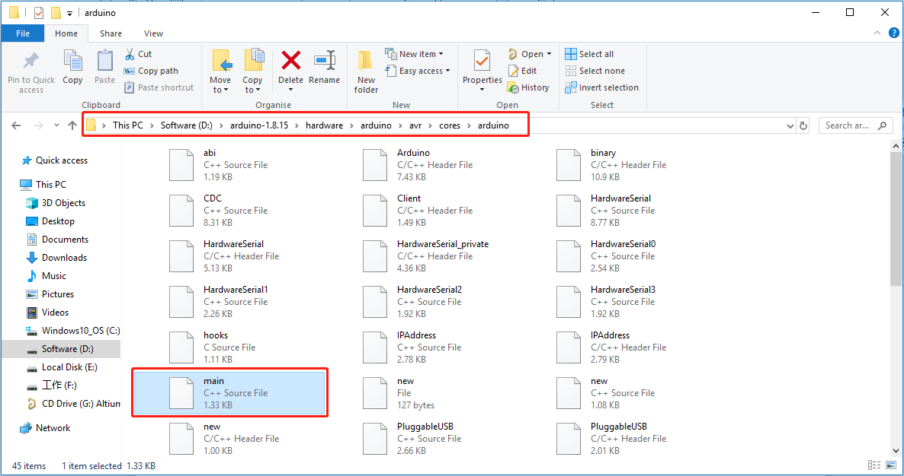
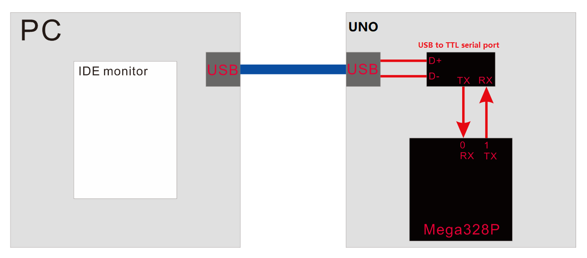
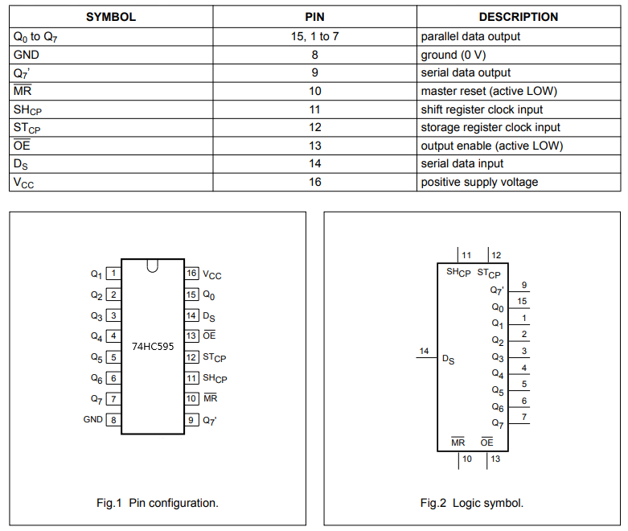
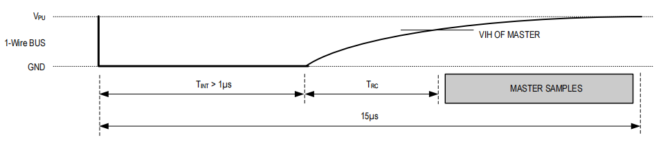

# Arduino_advanced_tutorial    
--------------------------- 
Learn communication protocol, driver programming and Arduino library development based on "UNO board + expansion board", and crack Arduino programming deeply with the lowest cost.      

## Previous preparation           
-----------------------
1. Install the [**Arduino IDE**](https://docs.mosiwi.com/en/latest/arduino/arduino_ide/arduino_ide.html).     
2. Basic operation of the [**Arduino UNO R3**](https://docs.mosiwi.com/en/latest/arduino/A1D0000_uno_r3/A1D0000_uno_r3.html) motherboard.       
3. Install the [**Mosiwi basic learning kit**](https://docs.mosiwi.com/en/latest/arduino/A1E0000_basic_learning_shield/A1E0000_basic_learning_shield.html#integration-library) library.  

```{tip}
If you've already done some of the steps above, you don't need to go through the steps you've already done.    
```    

## Chapter1 Arduino          
-------------------
The essence of the Arduino programming language is a combination of C and C++ programming languages, and there is only one main() function, and the initial program entry is also the main() function. In order to allow more people to use the Arduino platform to develop products, the Arduino team tried every means to lower the threshold of programming and hide the tedious details of program development. Open the "main.cpp" file under the Arduino IDE installation file as shown in the figure below, and you can intuitively analyze the above description.         
       
       
As can be seen from the figure above, the setup() and loop() functions in the Arduino IDE are only called in the main() function, and they are just ordinary function types.       

The definition of some other keywords and commonly used functions can also be found in the header file in the same folder as "main.cpp", and many other definitions can be found in the following path:     
       


## Chapter2 Library files for Arduino             
------------------------------------- 
Make an arduino library: [Click me](https://docs.mosiwi.com/en/latest/arduino/resources/make_an_arduino_library/make_an_arduino_library.html)


## Chapter3 Serial port        
-----------------------   
What is a serial port? [Click me](https://docs.mosiwi.com/en/latest/various_resources/serial_port/serial_port.html)      

The serial port on the UNO board, it is a TTL serial port, running the Universal Asynchronous Receiver-Transmitter (UART) protocol, the communication format is XXX-8-N-1 (xxx special rate, 8 bit data, no parity bit, 1 stop bit), and it is a full-duplex serial port.     
       

USB port of PC can not communicate with TTL serial port of Mega328 chip directly, because their communication protocol is different, so USB to TTL serial port chip needs to be used to convert USB signal to TTL signal.    
       

**6. Software serial port**      
In this example, we use the way of software simulation to realize a TTL serial port function, the data format of the serial port is XXx-8-N-1 (xxx: variable rate, 8-bit data, no parity check bit, 1 stop bit), the advantage of this way is that any two pins on the UNO board can be defined as a serial port.    

■ Open the "3.0.0_Soft_serial" example in the "[Mosiwi_Basic_Learning_Kit](https://docs.mosiwi.com/en/latest/arduino/A1E0000_basic_learning_shield/A1E0000_basic_learning_shield.html#integration-library)" library file, then select the board type and port, and then upload the code.    

■ Open the serial port, adjust the baud rate of the serial port monitor to 9600, fill in "hello mosiwi" in the transmission frame, and then click send, UNO board will receive the data from the new back to the serial port monitor.     
       

code analysis:       
1\. Define a soft serial port class.    
```c++
class SoftwareSerial { ... }
```

2\. The constructor of the SoftwareSerial class initializes the receive pin as input mode and the transmit pin as output mode, and initializes the private variables of the class (after the colon and before the curly braces).    
```c++
SoftwareSerial::SoftwareSerial(uint8_t receivePin, uint8_t transmitPin) : ...{
  ...
}
```

3\. Set the baud rate of the serial port.   
```c++
void SoftwareSerial::begin(long speed){ ... }    
```
The baud rate is used to calculate the time it takes to transfer a data bit:   
<center>bit_time = (1/speed)/(1/F_CPU )</center>

Then the bit time is divided into four parts, which is convenient for subsequent calculation of various bit delays:    
        
<center>bit_delay = (F_CPU / speed) / 4</center>  

In order to obtain the accurate delay of various transmitting bits and receiving bits, it is necessary to consider the influence of different versions of GCC compiler on the running speed of the program. See the source code for the calculation.    

4\. Set the receiving pin level change to generate an interrupt (PCINT --> PCMSK register).   
Using the PCINT function of MEGA328p, the interrupt can be generated when the level of each pin changes. The user needs to read the relevant register to determine which PCINT port has changed, and then jump into a specified program.    

5\. Then the object of soft serial port class enters the listening state.     
```c++
bool SoftwareSerial::listen(){ ... }  
```

6\. Enable the receiving pin of the serial port to interrupt when the level changes.    
```c++
void SoftwareSerial::setRxIntMsk(bool enable){ ... }
```

7\. Set interrupt vectors and functions: Interrupts generated by PCINT0--PCINT3 all call the recv() function.     
```c++
inline void SoftwareSerial::handle_interrupt(){
  if (active_object){
    active_object->recv();
  }
}

#if defined(PCINT0_vect)
ISR(PCINT0_vect){
  SoftwareSerial::handle_interrupt();
}
#endif

#if defined(PCINT1_vect)
ISR(PCINT1_vect, ISR_ALIASOF(PCINT0_vect));
#endif

#if defined(PCINT2_vect)
ISR(PCINT2_vect, ISR_ALIASOF(PCINT0_vect));
#endif

#if defined(PCINT3_vect)
ISR(PCINT3_vect, ISR_ALIASOF(PCINT0_vect));
#endif
```
More info: <http://www.nongnu.org/avr-libc/user-manual/group__avr__interrupts.html>    

8\. The receive function of the soft serial port that is executed if the level of the receive pin is changed.    
```c++
void SoftwareSerial::recv(){ ... } 
```
A 64-byte receive cache number is set and two Pointers, the receive cache header and the receive cache tail, are created. The two Pointers can point to any address in the array, and the cache tail pointer is incremented by 1 for each byte received.    
        

9\. Count the number of received data in the receive cache array and return the value.     
```c++
int SoftwareSerial::available(){ ... }
```
Algorithm:   
<center>Num = (tail + 64 - head) \% 64</center>        
  
The above algorithm can count the number of received data in the receive cache array in both cases tail > head and tail < head.     

10\. Reads all data in the receive buffer array byte by byte.     
```c++
int SoftwareSerial::read(){ ... }
```
The cache header pointer is incremented by 1 for each byte read, and the following is used to determine whether the cache is fully read:   
        

11\. Data is sent byte-by-byte from the send pin, with all interrupts turned off.   
```c++
size_t SoftwareSerial::write(uint8_t b){ ... }
```

<span style="color: rgb(255, 76, 65);">Note: Since the serial port is simulated for software, the Baud range is 1200 -- 19200 bps.</span>     

**7. Hardware serial port**       
Above, we used the IO port to simulate the serial port communication protocol for communication. In the process of communication, the processor is occupied for a long time (because the main program stream is delayed or cyclic waiting for signals), and the transmission time is relatively slow (affected by the delay, cycle and IO port output speed).    
Now most single-chip microcomputers have realized the serial communication function in the chip internal hardware, and there are special hardware receiving and transmitting units inside the hardware to process data. It is more convenient for the user to use, and the transmission speed is faster, and does not occupy the processor for a long time.    

For the use of hardware serial port based on arduino, please refer to:      
<https://www.arduino.cc/reference/en/language/functions/communication/serial/>     


## Chapter4 I2C communication protocol          
--------------------------------------
I2C communication protocol: [Click me](https://docs.mosiwi.com/en/latest/various_resources/iic/iic.html)        

**Software I2C communication protocol**      
This example is based on AHT20 temperature and humidity sensor, if you need specifications, please download here link: [AHT20](https://docs.mosiwi.com/en/latest/_downloads/c4aca48f8f8278cbf6820afb05e027ee/AHT20.pdf)       

AHT20 example code:    
■ Open the "3.1.0_AHT20_soft_i2c" example in the "[Mosiwi_Basic_Learning_Kit](https://docs.mosiwi.com/en/latest/arduino/A1E0000_basic_learning_shield/A1E0000_basic_learning_shield.html#integration-library)" library file, then select the board type and port, and then upload the code.    

**Hardware I2C port**     
AHT20 example code:    
■ Open the "3.1.1_AHT20_i2c" example in the "[Mosiwi_Basic_Learning_Kit](https://docs.mosiwi.com/en/latest/arduino/A1E0000_basic_learning_shield/A1E0000_basic_learning_shield.html#integration-library)" library file, then select the board type and port, and then upload the code.    
More info: [Wire](https://www.arduino.cc/reference/en/language/functions/communication/wire/)     

## Chapter5 SPI communication protocol           
--------------------------------------  
SPI communication protocol: [Click me](https://docs.mosiwi.com/en/latest/various_resources/spi/spi.html)      

**Software SPI**      
This example is based on BC7278 quad digital tube and button chip. If you need specifications, please download from this link: [BC7278](../_static/pdf/BC7278.pdf)      

Because the BC7278 chip does not have SPI chip selection pin (CS), the chip is in the enabled state after power on. So the UNO board (master device) only needs 3 roots to communicate with the BC7278 chip (slave device).     

BC7278 example code:       
■ Open the "3.2.0_BC7278_spi_soft" example in the "[Mosiwi_Basic_Learning_Kit](https://docs.mosiwi.com/en/latest/arduino/A1E0000_basic_learning_shield/A1E0000_basic_learning_shield.html#integration-library)" library file, then select the board type and port, and then upload the code.    

**Hardware SPI port**     
BC7278 example code:    
■ Open the "3.2.1_BC7278_spi" example in the "[Mosiwi_Basic_Learning_Kit](https://docs.mosiwi.com/en/latest/arduino/A1E0000_basic_learning_shield/A1E0000_basic_learning_shield.html#integration-library)" library file, then select the board type and port, and then upload the code.    
More info: [SPI](https://www.arduino.cc/reference/en/language/functions/communication/spi/)        

## Chapter6 3-wire communication             
--------------------------------
**1. Overview**      
This chapter will not explain the communication protocol, is based on 74HC595 serial input parallel output chip, explain the 3-wire communication mode.   

**2. 74HC595 internal hardware**       
Pin description:     
        

Built-in function:    
        
        

**3. Working principle**      
The 74HC595 has one 8-bit shift register, one memory register, and one 3-state parallel output bus. When OE is enabled (low level), data on the Ds enters the shift register at the rising edge of the SHcp clock, the storage register at the rising edge of the STcp clock, and outputs to the parallel bus. When the serial output (Q7 ') pin is on the eighth rising edge of the SCHcp clock, it will output the data of the first rising edge of the SCHcp clock, and so on, and then output the data of the second rising edge of the SCHcp clock.     
        

**4. Example code**          
Open the "3.3.0_74HC595_3wire_soft" example in the "[Mosiwi_Basic_Learning_Kit](https://docs.mosiwi.com/en/latest/arduino/A1E0000_basic_learning_shield/A1E0000_basic_learning_shield.html#integration-library)" library file, then select the board type and port, and then upload the code.    

Code analysis:       
Initialize the three IO ports of the 74HC595 chip and set them all to output mode.    
```
void Init_LED_IO(byte latchP, byte clockP, byte dataP){ ... }
```

One byte of data is sent out through the data sending IO port, and the data sending mode (MSBFIRST or LSBFIRST) is selected.    
The data are sent to the Ds (dataPin) pin, a rising edge signal is generated on the SH_CP (clockPin) pin, and the data are stored in the shift register of the 74HC595. Note that the data does not change the state of the 74HC595 pin; only when the STcp (latchPin) pin produces another rising edge signal will the data be stored in the 74HC595 storage register and change its pin state.    
```

void ShiftOut(byte dataPin, byte clockPin, byte bitOrder, byte val){ ... }
```
**MSBFIRST**: This indicates that the high bit of the data is sent first and the low bit of the data is sent later.     
**LSBFIRST**: This means that the low bit of the data is sent first, and the high bit is sent later.    

This function can turn on or off an LED.    
```
void SetLed(byte bit, byte OnOff){ ... }
```


## Chapter7 Infrared NEC communication protocol       
-----------------------------------------------  
Please refer to: [NEC communication protocol](https://docs.mosiwi.com/en/latest/various_resources/nec/nec.html)      

**1. Example code**          
Open the "3.4.0_IR_NEC" example in the "[Mosiwi_Basic_Learning_Kit](https://docs.mosiwi.com/en/latest/arduino/A1E0000_basic_learning_shield/A1E0000_basic_learning_shield.html#integration-library)" library file, then select the board type and port, and then upload the code.    


## Chapter8 OneWire communication protocol    
------------------------------------------  
**1. Overview**      
1-Wire is a bidirectional, half-duplex slow serial communication standard developed by Dallas Semiconductor Corp (now Maxim Integrated) that uses a single signal data line for communication. The standard data rate is 15.4kbps. But it is possible to overdrive 1-Wire communication to up to 125kbps.    

**2. Hardware wiring**     
The slave device on the 1-Wire bus can be powered by an external power source and also by a signal line. Most 1-Wire slave devices require only very low power or no power pins, and when powered by a parasitic power supply, the current on the bus is charged through diodes inside the slave device to capacitors inside, thereby powering the slave device.      
        

Each slave device on the bus contains a unique 64-bit code stored in ROM. The lowest 8-bit code is used to describe the type of slave device. The next 48 bits contain a unique serial number. The highest 8 bits contain the cyclic redundancy check generated from the previous 56-bit encoding.     
        

The 1-Wire bus is a master-slave communication system in which a master device is connected to one or more slave devices via a single data line. The data line requires a resistor pull-up to the power line, typical pull-up resistor values are between 1 kΩ and 4.7 kΩ. According to the power supply method, it can be divided into two wiring methods.   
■ Power supply:     
        

■ Parasitic power supply:    
        

**3. protocol analysis**     
The single-bus communication protocol defines several signal command types: reset pulse, presence pulse, write 0, write 1, read 0, read 1. Except for the presence pulse, all signal commands are initiated by the bus host.       
Let's take the DS18B20 temperature sensor as an example to explain the protocol.     

■ Initialization sequence - reset and presence pulse   
All communication with the slave starts with the initialization sequence, which consists of a reset pulse from the master followed by a presence pulse from the slave. When a slave sends a presence pulse in response to a reset pulse, it indicates to the host that it is attached to the bus and is ready to run. During the initialization sequence, the host sends a reset pulse by pulling the single bus down for at least 480 µs. The bus host then releases the bus into receive mode. When the bus is released, the 4.7kΩ pull-up resistor pulls the bus higher. When the slave detects this rising edge, it waits 15µs to 60µs and then emits a presence pulse by pulling the single bus down 60µs to 240µs.      
        

■ Write time slot    
There are two kinds of write time slots: "write 1" time slots and "write 0" time slots. The bus host writes a logical 1 to the slave device through the write 1 time slot and a logical 0 to the slave device through the write 0 slot. All write time slots must last at least 60µs and there must be a recovery time of at least 1µs between two write time slots. Both write slots are initiated by the host pulling the single-bus low. To generate a write 1 time slot, the bus host must release the single bus within 15µs after pulling it low. When the bus is released, the 4.7kΩ pull-up resistor pulls the bus higher. To generate a write 0 slot, after pulling a single bus low, the bus host must keep the bus low for the entire time slot (at least 60µs). The slave device will sample a single bus in a time window of at least 15µs to 60µs after the host initiates a write time slot. If at this sampling time the window bus is high, a 1 is written to the slave device. If the bus is low, a 0 is written to the slave device.     
        

■ Read the time slot      
The slave device can transmit data to the host only during the read slot issued by the host. All read time slots must last at least 60µs and the recovery time between two write time slots must be no less than 1µs. Read time slots are generated by the host pulling down the single bus for at least 1µs and then releasing the bus (see Figure 1).    
After the host initiates a read slot, the slave starts transferring 1's or 0's on the bus. The slave sends a 1 by holding the bus high and a 0 by pulling the bus low. When 0 is transmitted, the slave device releases the bus at the end of the time slot, after which the bus is pulled back to the high idle state by the pull-up resistor. The output data of the slave device is valid for 15µs after the falling edge of the start time slot, so the host must release the bus and sample the bus state within 15µs after the start of the time slot. Figure 2 illustrates that the sum of TINIT, TRC and TSAMPL E must be less than 15µs in a read time slot. Figure 3 shows that the timing margin of the system can be maximized by keeping tINT and tRC as short as possible, and by putting the host sampling time at the end of the 15µs period of the read time slot.    
Figure 1     
        

Figure 2     
        

Figure 3     
        


**1. Example code**         
Open the "3.5.0_EEPROM_1wire_soft" example in the "[Mosiwi_Basic_Learning_Kit](https://docs.mosiwi.com/en/latest/arduino/A1E0000_basic_learning_shield/A1E0000_basic_learning_shield.html#integration-library)" library file, then select the board type and port, and then upload the code.    
 
Datasheet of EEPROM: [EEPROM](../_static/pdf/DS2431.pdf)   

**End!**      
