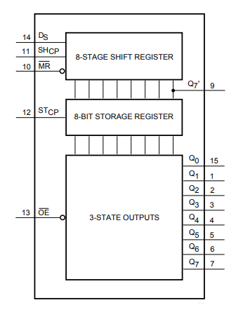
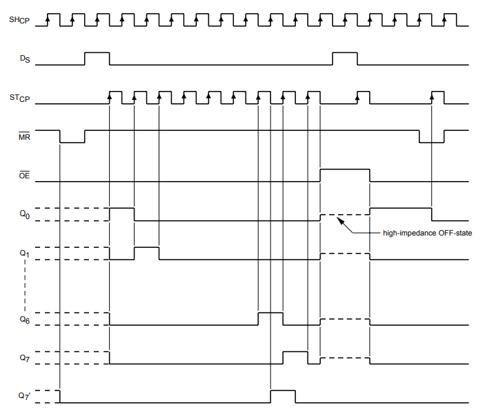
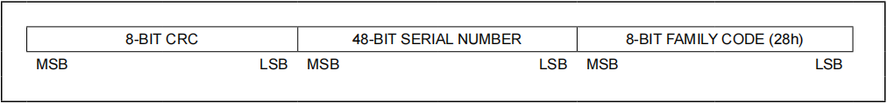
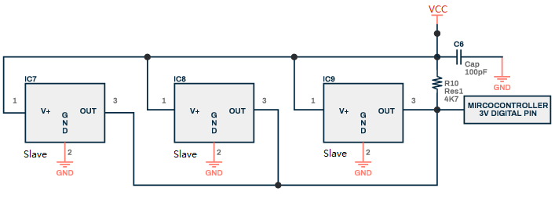
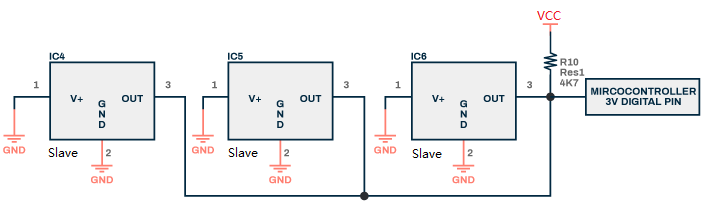
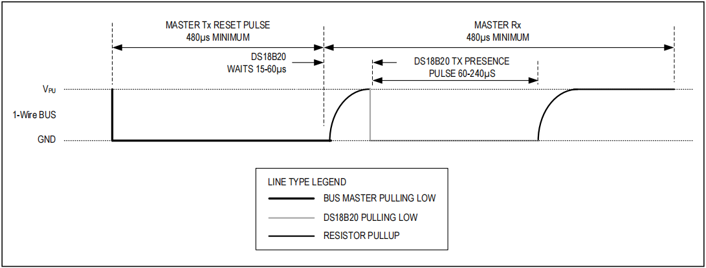
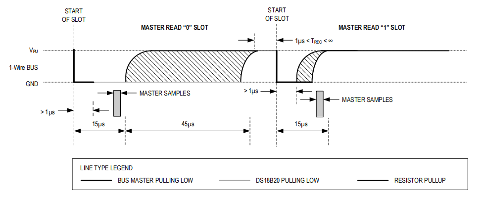

# Pico_advanced_tutorial    
------------------------
Learn the communication protocol, driver programming and MicroPyhotn module based on the "Pico board + expansion board" to learn MicroPython programming at the lowest cost.         

## Previous preparation    
-----------------------
**Pico and Thonny basics:**     
If you don't have Pico and Thonny basics, you can follow the link to learn the basics: [Click Me](https://docs.mosiwi.com/en/latest/raspberry/R1D0001_raspberry_pico/R1D0001_raspberry_pico.html)    


## Chapter1 Module for Pico    
---------------------------       
When you have multiple xx.py files, you can put them in a single folder to form a module file.      
1\. Create a new folder with an empty "\_\_init\_\_.py" file inside:     
       

2\. Then create a new file called "test.py" in that folder, and create a function and a class in that file:      
       
```python
def hello():
    print("hello!")
    
class prt:
    def __init__(self):
        pass
    def hello(self):
        print("class: hello!")
```

3\. Upload the folder to Pico:     
       

4\. Create a new file called "module_test.py" and call the functions and classes from the module:     
       
```python
import time                             # Importing the time class
from mosiwi_lib.test import hello, prt  #  Import prt class and hello function from the machine module.

Class = prt()
while True:                      # Always empty loop
    hello()
    Class.hello()
    time.sleep(1)                # sleep for 1 second
```

5\. The code runs successfully as follows:    
       


## Chapter2 Serial port      
----------------------- 
What is a serial port? [Click me](https://docs.mosiwi.com/en/latest/various_resources/serial_port/serial_port.html)     


## Chapter3 I2C communication protocol      
--------------------------------------
I2C communication protocol: [Click me](https://docs.mosiwi.com/en/latest/various_resources/iic/iic.html)     

## Chapter4 SPI communication protocol   
--------------------------------------            
SPI communication protocol: [Click me](https://docs.mosiwi.com/en/latest/various_resources/spi/spi.html)    

## Chapter5 3-wire communication          
--------------------------------             
**1. Overview**      
This chapter will not explain the communication protocol, is based on 74HC595 serial input parallel output chip, explain the 3-wire communication mode.   

**2. 74HC595 internal hardware**       
Pin description:     
        

Built-in function:    
        
        

**3. Working principle**      
The 74HC595 has one 8-bit shift register, one memory register, and one 3-state parallel output bus. When OE is enabled (low level), data on the Ds enters the shift register at the rising edge of the SHcp clock, the storage register at the rising edge of the STcp clock, and outputs to the parallel bus. When the serial output (Q7 ') pin is on the eighth rising edge of the SCHcp clock, it will output the data of the first rising edge of the SCHcp clock, and so on, and then output the data of the second rising edge of the SCHcp clock.     
        


## Chapter6 Infrared NEC communication protocol     
-----------------------------------------------            
Please refer to: [NEC communication protocol](https://docs.mosiwi.com/en/latest/various_resources/nec/nec.html)      


## Chapter7 OneWire communication protocol     
------------------------------------------           
**1. Overview**      
1-Wire is a bidirectional, half-duplex slow serial communication standard developed by Dallas Semiconductor Corp (now Maxim Integrated) that uses a single signal data line for communication. The standard data rate is 15.4kbps. But it is possible to overdrive 1-Wire communication to up to 125kbps.    

**2. Hardware wiring**     
The slave device on the 1-Wire bus can be powered by an external power source and also by a signal line. Most 1-Wire slave devices require only very low power or no power pins, and when powered by a parasitic power supply, the current on the bus is charged through diodes inside the slave device to capacitors inside, thereby powering the slave device.      
        

Each slave device on the bus contains a unique 64-bit code stored in ROM. The lowest 8-bit code is used to describe the type of slave device. The next 48 bits contain a unique serial number. The highest 8 bits contain the cyclic redundancy check generated from the previous 56-bit encoding.     
        

The 1-Wire bus is a master-slave communication system in which a master device is connected to one or more slave devices via a single data line. The data line requires a resistor pull-up to the power line, typical pull-up resistor values are between 1 kΩ and 4.7 kΩ. According to the power supply method, it can be divided into two wiring methods.   
■ Power supply:     
        

■ Parasitic power supply:    
        

**3. protocol analysis**     
The single-bus communication protocol defines several signal command types: reset pulse, presence pulse, write 0, write 1, read 0, read 1. Except for the presence pulse, all signal commands are initiated by the bus host.       
Let's take the DS18B20 temperature sensor as an example to explain the protocol.     

■ Initialization sequence - reset and presence pulse   
All communication with the slave starts with the initialization sequence, which consists of a reset pulse from the master followed by a presence pulse from the slave. When a slave sends a presence pulse in response to a reset pulse, it indicates to the host that it is attached to the bus and is ready to run. During the initialization sequence, the host sends a reset pulse by pulling the single bus down for at least 480 µs. The bus host then releases the bus into receive mode. When the bus is released, the 4.7kΩ pull-up resistor pulls the bus higher. When the slave detects this rising edge, it waits 15µs to 60µs and then emits a presence pulse by pulling the single bus down 60µs to 240µs.      
        

■ Write time slot    
There are two kinds of write time slots: "write 1" time slots and "write 0" time slots. The bus host writes a logical 1 to the slave device through the write 1 time slot and a logical 0 to the slave device through the write 0 slot. All write time slots must last at least 60µs and there must be a recovery time of at least 1µs between two write time slots. Both write slots are initiated by the host pulling the single-bus low. To generate a write 1 time slot, the bus host must release the single bus within 15µs after pulling it low. When the bus is released, the 4.7kΩ pull-up resistor pulls the bus higher. To generate a write 0 slot, after pulling a single bus low, the bus host must keep the bus low for the entire time slot (at least 60µs). The slave device will sample a single bus in a time window of at least 15µs to 60µs after the host initiates a write time slot. If at this sampling time the window bus is high, a 1 is written to the slave device. If the bus is low, a 0 is written to the slave device.     
        

■ Read the time slot      
The slave device can transmit data to the host only during the read slot issued by the host. All read time slots must last at least 60µs and the recovery time between two write time slots must be no less than 1µs. Read time slots are generated by the host pulling down the single bus for at least 1µs and then releasing the bus (see Figure 1).    
After the host initiates a read slot, the slave starts transferring 1's or 0's on the bus. The slave sends a 1 by holding the bus high and a 0 by pulling the bus low. When 0 is transmitted, the slave device releases the bus at the end of the time slot, after which the bus is pulled back to the high idle state by the pull-up resistor. The output data of the slave device is valid for 15µs after the falling edge of the start time slot, so the host must release the bus and sample the bus state within 15µs after the start of the time slot. Figure 2 illustrates that the sum of TINIT, TRC and TSAMPL E must be less than 15µs in a read time slot. Figure 3 shows that the timing margin of the system can be maximized by keeping tINT and tRC as short as possible, and by putting the host sampling time at the end of the 15µs period of the read time slot.    
Figure 1     
        

Figure 2     
        

Figure 3     
        

Datasheet of EEPROM: [EEPROM](../_static/pdf/DS2431.pdf)   

**End!**      
