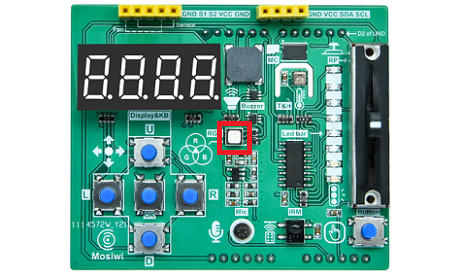
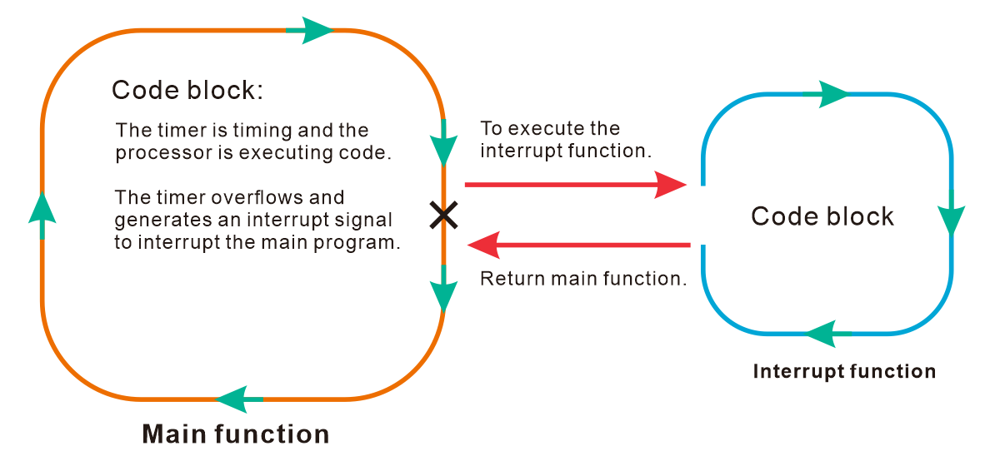

# Pico_basic_tutorial      
---------------------
This tutorial is based on the [C1K0001 4in1 basic learning kit](../Overview/Overview.md).     

Learn simple programming syntax based on the Pico board, and learn the most comprehensive Python basics in the fastest way.     

## What is MicroPython?      
-----------------------
MicroPython is a full implementation of the Python 3 programming language that runs directly on embedded hardware like Raspberry Pi Pico. You get an interactive prompt (the REPL) to execute commands immediately via USB Serial, and a built-in filesystem. The Pico port of MicroPython includes modules for accessing low-level chip-specific hardware.      
1. The [MicroPython](https://micropython.org/)
2. The [MicroPython Forums](https://forum.micropython.org/)  
3. MicroPython is a language derived from Python, so it is recommended to learn [Python](https://docs.python.org/3/reference/index.html) first.   

## Prepared knowledge     
---------------------         
**Learn about:** [**Basic learning shield**](https://docs.mosiwi.com/en/latest/arduino/A1E0000_basic_learning_shield/A1E0000_basic_learning_shield.html).  

**Learn about:** [**3in1 basic learning shield**](https://docs.mosiwi.com/en/latest/common/C1E0000_3in1_basic_learning_shield/C1E0000_3in1_basic_learning_shield.html).  

**Pico and Thonny basics:**     
If you don't have Pico and Thonny basics, you can follow the link to learn the basics: [Click Me](https://docs.mosiwi.com/en/latest/raspberry/R1D0001_raspberry_pico/R1D0001_raspberry_pico.html)    

**Learn about:** [**MicroPython for Pico**](https://docs.micropython.org/en/latest/rp2/quickref.html).  

**Download example code:**    
Please download the example code on Github: <https://github.com/Mosiwi/Mosiwi-basic-learning-kit> 
    
Unzip the file downloaded above, and the file in the "**pico->microPython**" folder is the example code.       

```{tip}
If you've already done some of the steps above, you don't need to go through the steps you've already done.       
```   

## Wiring diagram      
-----------------        
    

## Basic_chapter Blink      
----------------------            
**Objective:**     
1. Open the example code.     
2. Upload and run code.   
3. Verify that the pico motherboard works.        
4. Digital output pin.       

**Demonstration:**       
Open the "**blink\.py**" file as follows:     
    

Run the code online: (The code is not saved in pico and is not executed after repowering.)       
Make sure your Raspberry PI Pico's USB is plugged into your computer's USB via a usb cable, then click on "Python" and the version number in the bottom right corner of the Thonny window, then select "**MicroPython(Raspberry PI Pico). COMx** ".      
    

After running the code, the LED on the pico board lights up every 1 second:      
    

Run the code offline: (The code is stored in pico, and the code in pico is automatically executed after being powered on.)     
Enter the code in the main panel, then click on the "**Save**" or "**File->Save as ...**" menu. Thonny will present you with a popup, click on "**Raspberry Pi Pico**" and enter "**main\.py**" to save the code to the **Raspberry Pi Pico**.  
    
    
    

```{note}  
If you "save a file to the device" and give it the special name **main.py**, then MicroPython starts running that script as soon as power is supplied to Raspberry Pi Pico in the future. 

```      

**Code analysis:**                 
Pins and GPIO: [Click me](https://docs.micropython.org/en/latest/rp2/quickref.html#pins-and-gpio)      
Delay and timing: [Click me](https://docs.micropython.org/en/latest/rp2/quickref.html#delay-and-timing)           

Code comments:      
```python
Syntax:    
code block      # Comment text

In the example code:    
import time     # Importing the time class
```

import:     
```python
Syntax:
import modulename   

In the example code:    
import time     # Importing the time class
```

from xxx import xxx:    
```python
Syntax:
from modelname import member     

In the example code: 
from machine import Pin     # Import the Pin class from the machine module.    
```

while loop:        
    
    

```python
Syntax:
while (condition):
    conditional code
    ...

or 

while condition:
    conditional code
    ... 

Parameters:
condition: Boolean expression whose result is true or false.   

In the example code:   
while(1):                    # An infinite loop statement.
    button_value = Button.value()  # Read the key value
    if button_value == 1:          # Check whether the value of the key is 1, if so, turn off the LED.
        G_LED.off()                # Set pin to "off" (low) level
    else:                          # If the value of the key is not 1, the LED is turned on.
        G_LED.on()                 # Set pin to "on" (high) level  
```


## Chapter1 Button    
------------------               
**Objective:**     
1. What is button?     
2. What is resistance? 

**Pins to be used:**     
1. Button: GP21 
2. LED: GP25

**Schematic diagram:**       
    

**Open the example code: "button\.py"**     
1. Open the example code using the methods in **"[Basic_chapter](#basic-chapter-blink)"**.     
2. Run the example code online.      

**Example code phenomena:**         
After uploads the code, the led on the Pico is always off, and if the "Button" on the extension board is pressed, the LED is turned on.     
    

**FQA:**    
(1) What is a button?   
The key is A press switch, as shown in the following figure, A and B, C and D are directly connected inside, when no press, AB and CD are not connected, when the key is pressed, AB and CD are connected.    
    

(2) What is resistance?
The resistance of a conductor to the current is called its resistance. The greater the resistance of the conductor, the greater the obstruction effect of the conductor on the current. The resistance of a conductor is usually represented by the R symbol, the unit of resistance is ohms, and the symbol is Ω.     


Resistance is defined by the ratio of the voltage U at the two ends of the conductor to the current I passing through the conductor:      
$$R=U/I$$     

3-bit digital SMD resistor:(5%): 
Its resistance value can be obtained by calculating the code of the surface.      


4-bit digital SMD resistor:(1%): 
Its resistance value can be obtained by calculating the code of the surface.      


Code precision SMD resistors(1%):    
Read the code on its surface and look up the table to get its resistance value.       
    
    

Plug-in resistors:     
Color ring resistor uses different colors to show the resistance and accuracy, as shown below:    
    

**Code analysis:**            
Variable：          
Variables come from mathematics and are abstract concepts in computer language that can store calculation results or represent values. Variables can be accessed by variable name.         
    

Variable naming rules:      
1. Variable names can contain only alphanumeric characters and underscores (A-z, 0-9, and _).          
2. Variable names must start with a letter or underscore character Variable names cannot start with numbers.         
3. Variable names are case-sensitive ("age", "Age", and "AGE" are three different variables).            

```python
Syntax:    
VariableName = data 

int variable:  
var = 10    

long variable:  
var = 51924361L   

float variable:    
var = 10.1  

complex variable:   
var = 3.14j   

string variable:    
var = "mosiwi"  

list variable:   
var = [ 'mosiwi', 786 , 2.23, 'john', 70.2 ]   

tuple variable:    
var = ( 'mosiwi', 786 , 2.23, 'john', 70.2 )  

dictionary variable:    
var = {'name': 'mosiwi','code':6734, 'dept': 'sales'}       


In the example code:
button_value = Button.value()  # Read the key value

```


Judgment statement: 
if ... else ...         
    

```python
Syntax:
if condition: 
    conditional code
    ...  
else: 
    conditional code
    ...   

In the example code: 
if button_value == 1:          # Check whether the value of the key is 1, if so, turn off the LED.
    G_LED.off()                # Set pin to "off" (low: 0V) level
else:                          # If the value of the key is not 1, the LED is turned on.
    G_LED.on()                 # Set pin to "on" (high: 3.3V) level
```

Additional knowledge: if    
    

```python
Syntax:
if condition: 
    conditional code   

example:   
if a > 2:   
    b = 10
```


## Chapter2 Buzzer   
------------------             
**Objective:**     
1. What is PWM output?      
2. What is buzzer?   
3. What is MOS transistor?      

**Pins to be used:**   
1. Buzzer: GP6  

**Schematic diagram:**       
    

**Open the example code: "buzzer\.py"**     
1. Open the example code using the methods in **"[Basic_chapter](#basic-chapter-blink)"**.     
2. Run the example code online. 

**Example code phenomena:**         
After uploading the code, the buzzer on the expansion board will keep beeping with a fixed frequency and different volumes.       
    
<span style="color: rgb(255, 76, 65);">Note: A passive buzzer is used on the extension board.</span>        

**FQA:**   
(1) What is PWM output?      
PWM, called pulse width modulation signal, is a square wave signal with fixed frequency and variable duty cycle time. In the figure below, T is the cycle time, which is fixed; A is high level (Pico high level is 3.3V); B is low level (Pico high level is 0V); The level width of A and B in the period T time is changeable, the longer the pulse time of the high level, the larger the average voltage value, and the smaller the vice versa.          
    
Note: T = A + B     

         
See more: [PWM for Pico](https://docs.micropython.org/en/latest/rp2/quickref.html#pwm-pulse-width-modulation)     

(2) What is buzzer?    
See: [Buzzer](../Arduino_tutorial/intermediate_tutorial.md#chapter5-buzzer)    

(3) What is MOS transistor?
MOS, is MOSFET (Metal-Oxide-Semiconductor Field-Effect Transistor) abbreviation.      
Mosfets are four-terminal devices with source (S), gate (G), drain (D), and body (B) terminals. Typically, the B terminal is connected to the S terminal, resulting in a three-terminal device. MOS transistors can be divided into enhanced MOS transistors and depletion MOS transistors, which can be subdivided into N-channel MOS transistors and p-channel MOS transistors. The enhanced MOS transistors are more widely used in the two types.     
    

MOS transistors are commonly used as switches. If the voltage between the drain and the source reaches the threshold voltage, the G and S poles are conducted, otherwise they are not conducted. Common circuits are as follows:   
    

A 2N7002DW1T1G MOS is used to drive the buzzer on the extension board. It is a dual-body enhanced n-channel MOS transistor that uses one of the MOS to drive the buzzer. When a voltage greater than 2V is applied to its gate, the MOS drain and source are energized and therefore the buzzer is energized. Otherwise the buzzer is on.       
    


**Code analysis:**          
range() function:   
```python
Syntax:
range(stop)
range(start, stop[, step])  

Parameters:
start -> The value of the start parameter (or 0 if the parameter was not supplied)
stop  -> The value of the stop parameter
step  -> The value of the step parameter (or 1 if the parameter was not supplied)

Range examples:
>>> list(range(10))
[0, 1, 2, 3, 4, 5, 6, 7, 8, 9]

>>> list(range(1, 11))
[1, 2, 3, 4, 5, 6, 7, 8, 9, 10]

>>> list(range(0, 30, 5))
[0, 5, 10, 15, 20, 25]

>>> list(range(0, 10, 3))
[0, 3, 6, 9]

>>> list(range(0, -10, -1))
[0, -1, -2, -3, -4, -5, -6, -7, -8, -9]

>>> list(range(0))
[]

>>> list(range(1, 0))
[]

```

for loop:    
    

```python
Syntax:   

for <variable> in <sequence>:
    <statements>
else:
    <statements>

In the example code:  
for i in range(0, 65536):     # The loop executes the next two statements 65,536 times.
    time.sleep_us(50)         # Sleep for 50 microseconds
    buzzer.duty_u16(i)        # Set duty cycle of the PWM, 0 to 65535
```


## Chapter3 Potentiometer    
-------------------------          
**Objective:**    
1. What is voltage?    
2. What is potentiometer?         
3. What is ADC?   

**Pins to be used:**   
1. Potentiometer: GP28_A2    

**Schematic diagram:**       
    

**Open the example code: "potentiometer\.py"**     
1. Open the example code using the methods in **"[Basic_chapter](#basic-chapter-blink)"**.     
2. Run the example code online. 

**Example code phenomena:**         
Push the potentiometer up and down, and the terminal prints the corresponding analog value and voltage value.          
    

**FQA:**      
(1) What is voltage?             
The voltage is called potential difference or potential difference, the international unit is volts (V), and the commonly used units are millivolts (mV), microvolts (μV), and kilovolts (kV).     
$$1KV = 1000V, 1V = 1000mV, 1mV = 1000uV$$    

The relationship between voltage, current and resistance:   
$$I=U/R$$   
I: current, unit A.   
U: voltage, unit V.   
R: resistance, unit Ω. 

(2) What is potentiometer?    
Sliding potentiometer is a resistance element with adjustable resistance value and three leading ends. It usually consists of a resistive body and a removable brush. When the brush moves along the resistance body, the resistance value or voltage that is related to the displacement can be obtained at the output end.      
    

(3) What is ADC (Analog to Digital Converter)? 
See: [ADC for Pico](https://docs.micropython.org/en/latest/rp2/quickref.html#adc-analog-to-digital-conversion)       

**Code analysis:**         
print function: [Click me](https://docs.python.org/3/library/functions.html#print)        

Multiplication (*):    
```python
Syntax:
product = operand1 * operand2

Parameters:
product: variable (result).
operand1: variable or constant (multiplicand).
operand2: variable or constant (multiplier).

example code:
num = 2*5
The result is 10.
```

Division operation (/):   
```python
Syntax:
result = numerator / denominator

Parameters:
result: variable (result).
numerator: variable or constant (dividend).
denominator: Variable or constant (divisor), which cannot be 0.

example code:
num = 2/5
The result is 2.5.   
```

```python
In the example code:
print("Voltage value: %.2fV" %((3.3/65536)*adc))      #  (3.3/65536)*adc
```

Here's some additional knowledge:

Addition operation (+):    
```python
Syntax:
sum = operand1 + operand2

Parameters:
sum: variable (result).
operand1: variable or constant (addition).
operand2: variable or constant (addition).

example code:
num = 10+1
The result is 11.
```

Subtraction operation (-):     
```python
Syntax:
difference = operand1 - operand2

Parameters:
difference: variable (result).
operand1: variable or constant (subtraction).
operand2: variable or constant (subtract).

example code:
num = 10-1
The result is 9.
```

Remainder operation (%):   
```python
Syntax:
remainder = dividend % divisor

Parameters:
remainder: variable (result).
dividend: Variable or constant (dividend).
divisor: Variable or constant (divisor) that cannot be 0.

example code:
num = 2%5
The result is 1. 
```


## Chapter4 Timer        
-----------------           
**Objective:**     
1. What is timer?           

**Pins to be used:**   
1. Red RGB LED: GP8             

**Schematic diagram:**       
    

**Open the example code: "timer\.py"**     
1. Open the example code using the methods in **"[Basic_chapter](#basic-chapter-blink)"**.     
2. Run the example code online. 

**Example code phenomena:**            
The red LED on the expansion board shines once every 1 seconds.    
    

**FQA:**   
(1) What is timer?     
A timer is equivalent to an alarm clock, which can set a time, generate a signal (equivalent to an interrupt) at every set time, and perform another thing when the signal is generated.      

When the timer count reaches the set time, an interrupt signal is generated for the processor to execute a short program.      
    

See: [Timer for Pico](https://docs.micropython.org/en/latest/rp2/quickref.html#timers)       

**Code analysis:**    
To use a global variable in a function:       
```python
Syntax:
global  VariableName  

In the example code:
ledstate = 0;                # Define a global variable

def mycallback(t):           # Timed interrupt function
    global ledstate          # Use the "global" keyword to declare that the variable is global, otherwise it is local.
    ledstate = 1 - ledstate  # The global variable ledstate is either 0 or 1. 
    R_LED.value(ledstate)    # Turn on or off the LED.

```

pass:    
Do not do anything, generally used as placeholder statements.     
```python
Syntax:   
loop statement:    
    pass

In the example code:  
while True:                  # Always empty loop
    pass
```

Define a function:    
```python
Syntax:   
def functionname(parameters1, parameters2, ... ):
    ...
    code block
    return [expression]      #  When this statement is omitted, the function has no return value.

In the example code:   
def mycallback(t):           # Timed interrupt function
    global ledstate          # Use the "global" keyword to declare that the variable is global, otherwise it is local.
    ledstate = 1 - ledstate  # The global variable ledstate is either 0 or 1. 
    R_LED.value(ledstate)    # Turn on or off the LED.
```


## Chapter5 Watchdog       
--------------------              
**Objective:**     
1. What is Watchdog?             

**Open the example code: "wdt\.py"**     
1. Open the example code using the methods in **"[Basic_chapter](#basic-chapter-blink)"**.     
2. Run the example code online. 

**Example code phenomena:**         
At the beginning of the program, let the LED on the Pico board blink once, and then set the dog feeding time of the watchdog to within 30 seconds, so that the program will always loop empty. Because the dog was not fed in time, the Pico reset every 30 seconds, and the LED on the Pico class flickered every time it was reset.             
    

```{note}
When practicing, don't set the dog feed time so short that the Pico keeps resetting and can't communicate with Thonny. At this point you have to [re-burn the UF2 file](https://docs.mosiwi.com/en/latest/raspberry/R1D0001_raspberry_pico/R1D0001_raspberry_pico.html#using-micropython-in-thonny).     
```  

**FQA:**   
(1) What is Watchdog?    
The watchdog is also a timer, and the set time must be refreshed within the set time, otherwise it will cause the chip to reset. Use this function to prevent the program from running incorrectly or out of control.      
See: [WDT for Pico](https://docs.micropython.org/en/latest/rp2/quickref.html#wdt-watchdog-timer)           


**End!**    

